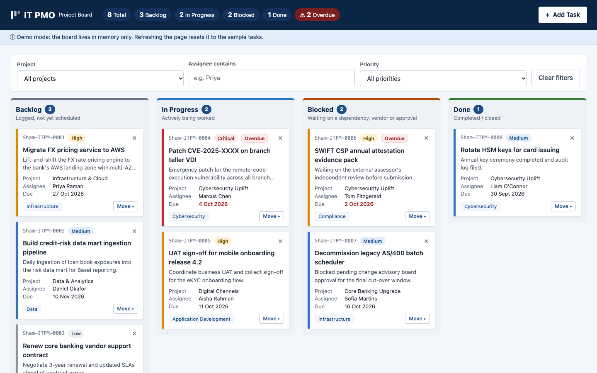
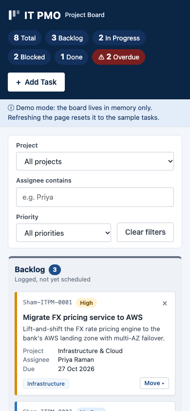

# IT PMO Kanban Board

A single-page Kanban board for the internal IT Project Management Office of a fictitious bank, built as a demo and training tool. It's written in plain HTML, CSS and JavaScript in one `index.html` file. There's no framework, no build step and no backend apart from optional email notifications through [FormSubmit](https://formsubmit.co).

**Live demo:** https://shamil707.github.io/it-pmo-kanban/

> Demo mode: the board lives in memory only. Refreshing the page resets it to the eight sample tasks.

## Screenshots





*Desktop (1440×900) and mobile (390×844) views, captured with the Playwright MCP server.*

## Features

- **Four fixed columns:** Backlog, In Progress, Blocked and Done, each with a live task count.
- **Cards** show the task ID (`Sham-ITPM-####`), title, project, assignee, priority, due date and category. The left border is colour-coded by priority, and the priority is always written out too.
- **Overdue badge** on tasks past their due date that aren't Done.
- **Moving cards:**
  - drag and drop with the native HTML5 API, with the target column highlighted
  - a keyboard-accessible **Move ▸** menu on every card
- **Inline delete confirmation** ("Delete? Yes / No"), with no browser pop-up.
- **Add Task panel** with checks before saving and errors shown under each field. The card appears straight away, and the email notification is sent in the background.
- **Filters** by project, assignee (name contains) and priority.
- **Summary strip** with totals per status and an overdue count.
- **Accessibility:** proper page structure, visible focus outlines, labelled icon-only buttons, and notifications read out by screen readers.
- **Responsive:** columns sit side by side on desktop and stack below 768px.

## Run locally

Open `index.html` in a browser by double-clicking it; no server is needed.

To test email notifications, serve the file over HTTP, because FormSubmit tends to reject requests from pages opened straight from disk:

```sh
python3 -m http.server 8000
# open http://localhost:8000
```

## Configuration

Email notifications for new tasks are sent through FormSubmit's AJAX endpoint. Set the destination address in the CONFIG section at the top of the `<script>` block in `index.html`:

```js
const FORMSUBMIT_ENDPOINT = "https://formsubmit.co/ajax/YOUR_EMAIL@example.com";
```

- **One-time activation:** the first submission sends a confirmation email to that address. Nothing is delivered until someone clicks the activation link in it.
- While the placeholder address is still set, no request is sent, and the app shows "Card added locally — email notification failed".
- The repository is public, so any address you commit here is public too.

## Deployment (CI/CD)

`.github/workflows/deploy-pages.yml` runs on GitHub Actions:

- **`ci`** runs on every push and pull request to `main`:
  - syntax-checks the inline script with Node
  - fails if the project rules below are broken
  - scans the full git history for secrets with Gitleaks
- **`deploy`** runs on pushes to `main` (or a manual run) once `ci` passes, and publishes `index.html` to GitHub Pages.

The repository's Pages source must be set to **GitHub Actions**, under Settings → Pages → Build and deployment.

## Project constraints

Contributions need to keep to these rules:

- **Plain code only:** vanilla HTML, CSS and JavaScript. No frameworks, libraries, bundlers or npm.
- **One file:** everything stays in `index.html`, and it must still work when opened by double-clicking.
- **No external resources:** no CDNs, web fonts or image files. Use system fonts and inline SVG or Unicode for icons.
- **No saved data:** no `localStorage`, `sessionStorage`, IndexedDB or cookies.
- **No browser pop-ups:** no `alert()` or `confirm()`.
- **No `!important`** in the CSS.
- **Escaping:** all user-supplied text goes through `escapeHtml()` before it's put into the page.

See `CLAUDE.md` for how the code is put together.
